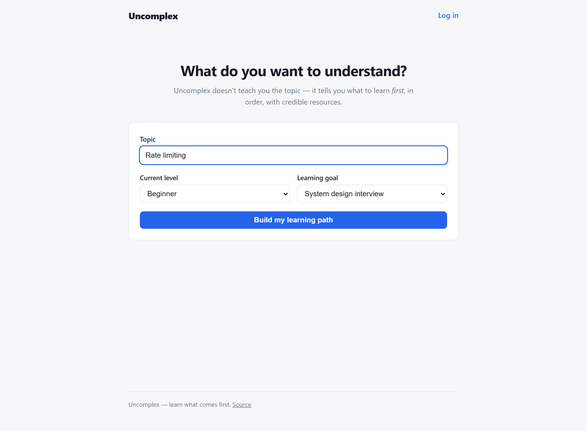
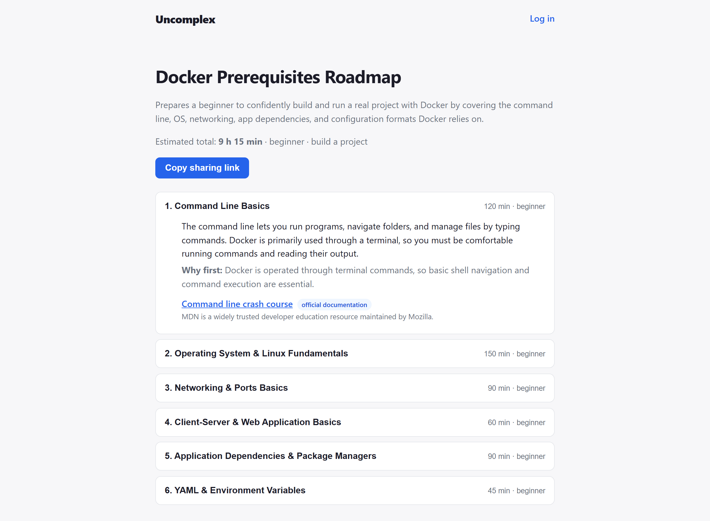
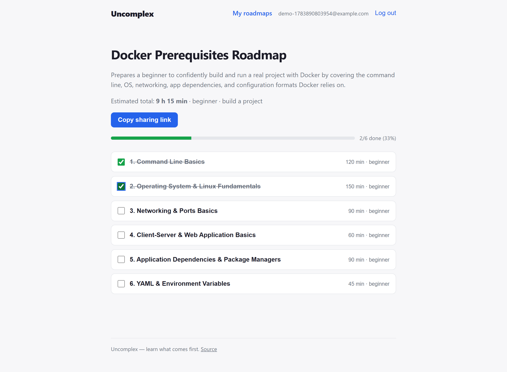
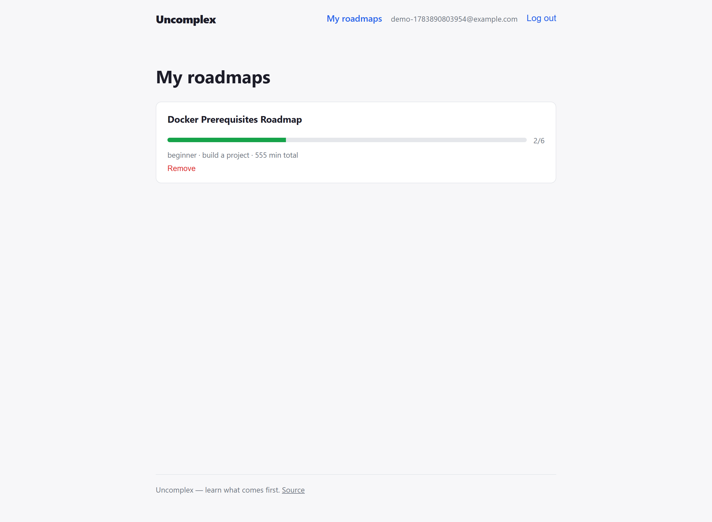

<div align="center">

# Uncomplex

**Enter anything you want to learn — Uncomplex tells you what to understand *first*, in order, with credible resources.**

[](https://github.com/Jainoir/Uncomplex/actions/workflows/ci.yml)

🌐 **[Try it live](https://uncomplex.vercel.app)** · [API health](https://uncomplex-api.onrender.com/actuator/health)
<sub>free hosting tier — the first request after idle takes ~1 min to wake the API</sub>

</div>

Most learning tools answer *"how do I learn X?"*. Uncomplex answers the question that actually blocks people: *"why doesn't X make sense to me yet?"* — which is almost always **missing prerequisites**. The ordering is the product; the links are the bonus.

**Jump to:** [How it works](#how-it-works) · [Tech stack](#tech-stack) · [Run it yourself](#run-it-yourself) · [API](#api) · [Architecture](#architecture) · [Design decisions](#design-decisions-and-why) · [Testing](#testing-strategy) · [Configuration](#configuration)

---

## How it works

### 1 · Say what you want to learn, where you're at, and why

<p align="center"></p>

### 2 · Claude builds your prerequisite path — validated, ordered, time-boxed

One AI call produces 4–8 prerequisite concepts. Every concept explains **what it is** and **why it comes first**. Every resource link must survive a credibility allowlist (official docs, standards bodies, universities) before it's stored — a hallucinated URL can never reach you.

<p align="center"></p>

### 3 · Track your progress node by node

With an account, the roadmap becomes a checklist. Progress is per-user: share the same roadmap with a friend and you each get your own checkboxes.

<p align="center"></p>

### 4 · Keep a library — and share any roadmap with a link

Every roadmap gets a public URL like `/r/docker-qn9wb` that anyone can open, **no account needed**. Generating the same topic/level/goal twice never calls the AI twice — repeats are served from PostgreSQL in milliseconds.

<p align="center"></p>

---

## Tech stack

| Layer | Technologies |
|---|---|
| Backend | Java 21 · Spring Boot 3.5 · Spring Security (JWT resource server) · Spring Data JPA / Hibernate |
| Data | PostgreSQL + Flyway migrations · Redis (distributed rate limiting) |
| AI | Anthropic Claude API with **structured outputs** (JSON schema derived from Java records) |
| Frontend | React 19 · TypeScript · Vite · React Router |
| Testing | JUnit 5 · Mockito · MockMvc · Testcontainers (real PostgreSQL & Redis in CI) |
| Ops | Docker · docker-compose · GitHub Actions · Render (API + DB) · Vercel (frontend) |

## Run it yourself

**Zero dependencies** — in-memory H2 database + deterministic mock AI, no API key needed:

```bash
./mvnw spring-boot:run -Dspring-boot.run.profiles=local
```

**Frontend** — the dev server proxies `/api` to the backend on :8080:

```bash
cd frontend && npm install && npm run dev   # http://localhost:5173
```

**Full stack with real AI** — PostgreSQL + Redis via Docker, live Claude generation:

```bash
export AI_PROVIDER=anthropic
export ANTHROPIC_API_KEY=sk-ant-...
docker compose up --build
```

**Tests:**

```bash
./mvnw verify
```

The PostgreSQL and Redis Testcontainers suites skip automatically without Docker and run in CI.

## API

**Public — no account needed:**

| Method | Path | Description |
|---|---|---|
| `POST` | `/api/roadmaps` | Generate (or serve cached) roadmap. Rate limited. With a JWT, also saves to your library. |
| `GET` | `/api/roadmaps/public/{shareToken}` | Open a shared roadmap. Never rate limited. |
| `POST` | `/api/auth/register` | Create an account (email + password ≥ 8 chars). |
| `POST` | `/api/auth/login` | Get an access token + refresh token. |
| `POST` | `/api/auth/refresh` | Rotate: exchange a refresh token for a fresh pair. |
| `POST` | `/api/auth/logout` | Revoke a refresh token. |
| `GET` | `/actuator/health` | Health probe. |

**Authenticated — `Authorization: Bearer <token>`:**

| Method | Path | Description |
|---|---|---|
| `GET` | `/api/me/roadmaps` | My library, with per-roadmap progress counts. |
| `POST` | `/api/me/roadmaps` | Save any shared roadmap (`{"shareToken": "..."}`). |
| `GET` | `/api/me/roadmaps/{id}` | One roadmap + my progress overlay (completed node ids, percent). |
| `PUT` | `/api/me/roadmaps/{id}/nodes/{nodeId}/progress` | Mark a node `{"completed": true/false}`. Idempotent. |
| `DELETE` | `/api/me/roadmaps/{id}` | Remove from my library (the shared roadmap survives for others). |

Errors follow RFC 9457 problem details (`400` validation, `404` unknown token, `429` rate limit, `502` generation failure).

## Architecture

Modular monolith — one Spring Boot application with strict package boundaries, so modules could be extracted later without a rewrite:

```
com.uncomplex
├── roadmap      controller / service / repository / entity / dto / mapper
├── ai           provider-agnostic generation + output validation
├── resource     resource credibility (URL allowlist) + link liveness checking
├── auth         register/login, JWT issuing, refresh token rotation
├── user         account entity + repository
├── library      saved roadmaps + per-node progress (the "ownership" model)
├── ratelimit    pluggable rate limiting (in-memory token bucket / Redis fixed window)
├── config       typed @ConfigurationProperties, security filter chain, AI wiring
└── exception    RFC 9457 problem-detail handling
```

## Design decisions (and why)

**The AI is treated as an untrusted dependency.** This is the load-bearing design choice:

1. **Structured outputs, not prompt-and-pray.** The Anthropic SDK constrains the model's response to the `RoadmapDraft` JSON schema (derived from Java records). No hand-rolled JSON parsing, no "please respond in JSON" prompting.
2. **Schema-valid ≠ trustworthy.** `RoadmapDraftValidator` re-checks everything the schema can't express: 4–8 prerequisites, non-blank fields, clamped time estimates, ordering. Invalid output is retried once, then fails with a clean `502`.
3. **AI-generated URLs are never trusted.** Every resource link must be `https` on a configurable allowlist of credible domains (official docs, standards bodies, `*.edu`). Anything else is silently dropped.

**One AI call per (topic, level, goal) — ever.** Requests are normalized into a cache key (`rate-limiting|beginner|system_design_interview`) with a unique DB constraint. Repeat requests and shared-link opens are pure reads. A race between concurrent first requests is resolved by the constraint, not by locks.

**Anonymous-first, accounts optional.** The unguessable share token *is* the access control for reading, so the product works with zero accounts. Accounts (stateless HS256 JWTs via Spring Security's resource-server support, BCrypt passwords) add a *library*: which roadmaps you follow and which nodes you've completed.

**Users own membership and progress — never the roadmap.** Because roadmaps are cached and shared across users, letting one user edit a roadmap would corrupt it for everyone else reading it. So shared roadmaps are immutable; ownership is a `saved_roadmap` join row plus per-user `node_progress` rows. Deleting "your" roadmap removes it from your library without touching anyone else's.

**Refresh tokens rotate, and reuse is treated as theft.** Login returns a short-lived JWT plus an opaque refresh token (only its SHA-256 hash is stored). Every refresh revokes the presented token and issues a new pair; replaying an already-rotated token is a theft signal, so *all* of that user's sessions are revoked. Login failures return the same 401 for unknown email and wrong password (no account enumeration).

**Rate limiting is pluggable** (`app.rate-limit.store`): an in-memory Bucket4j token bucket for single-instance deployments (default), or a Redis fixed-window counter (atomic `INCR` + first-write `EXPIRE`) shared across replicas. The trade-off is documented in the code: the fixed window permits a brief boundary burst but keeps the hot path to one round trip.

**Dead links get caught after the fact.** The credibility allowlist filters URLs at generation time; a nightly scheduled job (`HEAD` probe, `GET` fallback) marks resources `reachable: true/false` in the API so a link that dies later is flagged instead of silently served.

**Why not microservices/Kafka/Kubernetes?** One team, one database, one deployable. The module boundaries keep extraction possible; the operational cost of distribution buys nothing at this scale.

## Testing strategy

| Layer | Tool | What it proves |
|---|---|---|
| Unit | JUnit 5 + Mockito | Validator rules, allowlist edge cases (incl. suffix-spoofed domains), cache-hit short-circuits the AI call, retry-then-fail behavior |
| Integration | `@SpringBootTest` + MockMvc + H2 | Full HTTP flows: generate → share → open link, auth journeys, refresh rotation + reuse detection, progress tracking, validation errors, 429 rate limiting |
| Real infrastructure | Testcontainers | Flyway migrations + JPA mappings against actual PostgreSQL; the Redis rate limiter against actual Redis (auto-skipped without Docker, run in CI) |

## Configuration

| Variable | Default | Purpose |
|---|---|---|
| `AI_PROVIDER` | `mock` | `anthropic` for real generation |
| `ANTHROPIC_API_KEY` | — | Required when `AI_PROVIDER=anthropic` |
| `DB_URL` / `DB_USERNAME` / `DB_PASSWORD` | localhost Postgres | Database connection (or `DB_HOST`/`DB_PORT`/`DB_NAME`) |
| `JWT_SECRET` | dev-only default | HS256 signing key (≥ 32 bytes). **Set in every deployed environment.** |
| `TOKEN_TTL_MINUTES` | `60` | Access-token lifetime |
| `REFRESH_TOKEN_TTL_DAYS` | `30` | Refresh-token lifetime |
| `GENERATIONS_PER_DAY` | `10` | Per-client generation limit |
| `RATE_LIMIT_STORE` | `memory` | `redis` for multi-replica deployments |
| `LINK_HEALTH_ENABLED` | `true` | Nightly resource-link liveness probing |
| `CORS_ALLOWED_ORIGINS` | `http://localhost:5173` | Comma-separated frontend origins |

Deployment is codified in the repo: [`render.yaml`](render.yaml) (API + PostgreSQL Blueprint) and [`frontend/vercel.json`](frontend/vercel.json) (SPA rewrites).

## Project roadmap

- ~~**Milestone 1** — anonymous generate / persist / share~~ ✅
- ~~**Milestone 2** — JWT authentication, saved-roadmap library, per-node progress tracking~~ ✅
- ~~**Milestone 3** — refresh token rotation with reuse detection, Redis-backed rate limiting, scheduled link liveness checking~~ ✅
- ~~**Milestone 4** — React/TypeScript frontend (landing, roadmap + progress, shared view, auth, library)~~ ✅
- ~~**Deployed** — API + PostgreSQL on Render, frontend on Vercel~~ ✅
- **Later** — per-node regeneration, FR/EN bilingual content, dependency graph view

See [PROGRESS.md](PROGRESS.md) for the detailed checklist.
